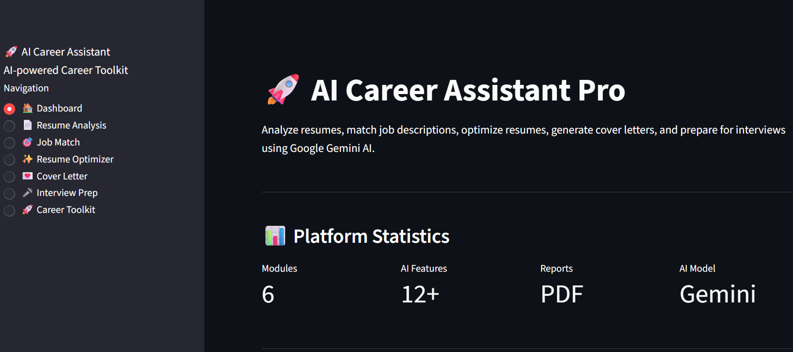
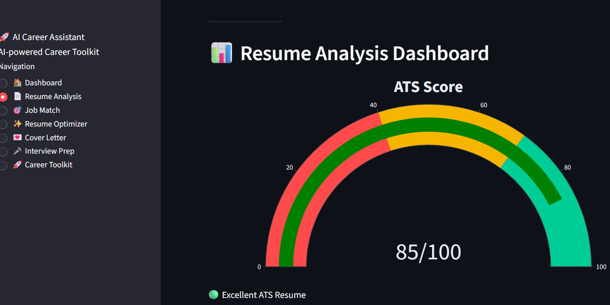
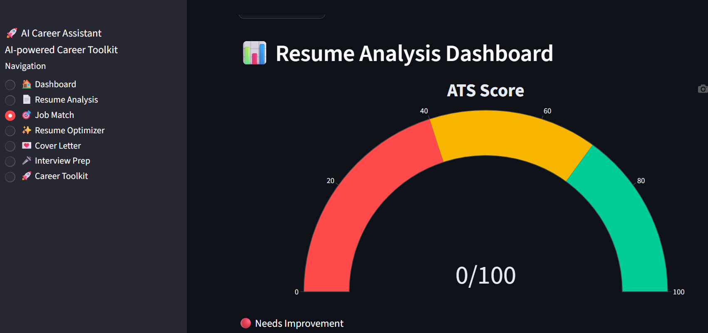
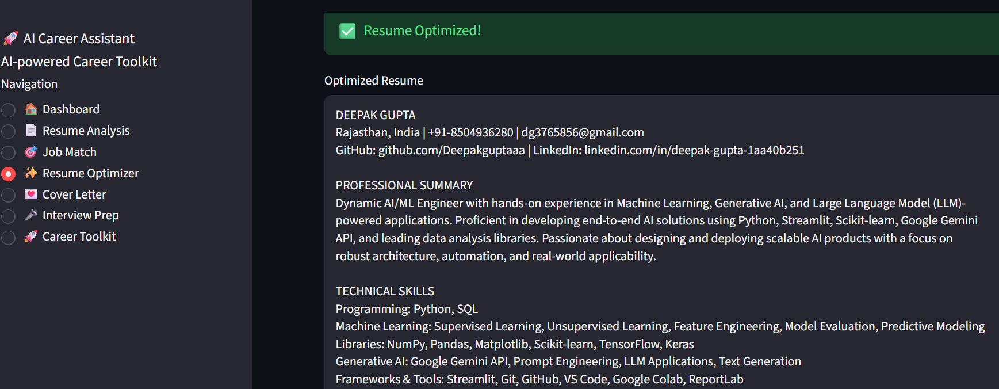
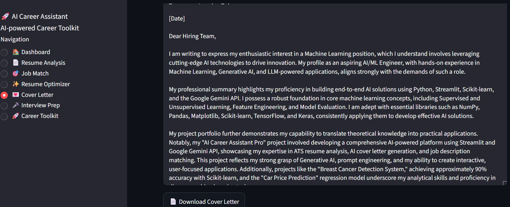
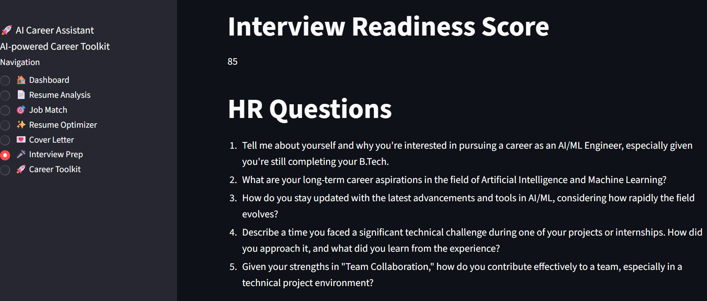
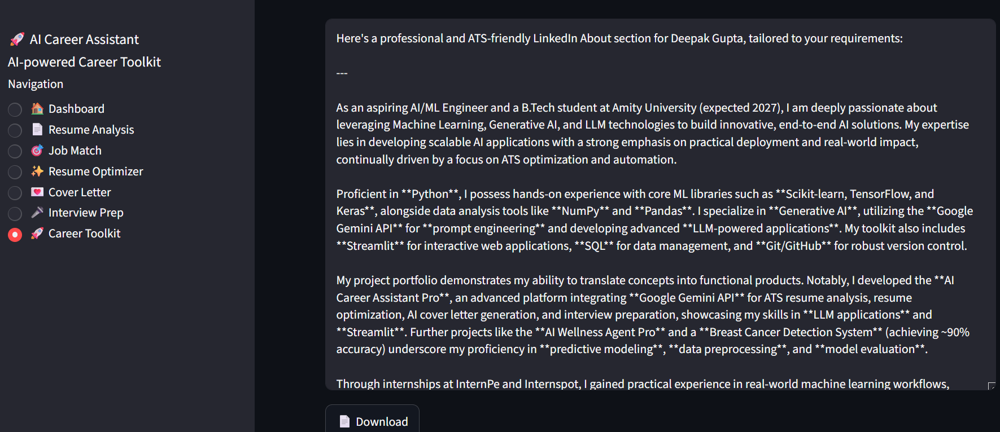

# 🚀 AI Career Assistant Pro

An AI-powered career toolkit built with **Python**, **Streamlit**, and **Google Gemini AI** that helps students and professionals improve their resumes, optimize ATS scores, generate cover letters, prepare for interviews, and enhance their job applications.

---

## ✨ Features

* 📄 Resume Analysis

  * ATS Score
  * Strengths & Weaknesses
  * Technical Skills Detection
  * Missing Skills Identification
  * Improvement Suggestions

* 🎯 Job Description Match

  * Resume vs Job Description Comparison
  * Match Score
  * Missing Keywords
  * ATS Optimization Tips

* ✨ Resume Optimizer

  * Rewrite Resume
  * Improve Professional Language
  * Strong Action Verbs
  * ATS-Friendly Content

* 💌 Cover Letter Generator

  * Personalized Cover Letters
  * Company Specific
  * Role Specific

* 🎤 Interview Preparation

  * HR Questions
  * Technical Questions
  * AI/ML Interview Questions
  * Project-Based Questions

* 🚀 Career Toolkit

  * LinkedIn Summary
  * Resume Headline
  * Professional Bio
  * Recruiter Email

* 📄 Download Professional PDF Reports

---

## 🛠 Tech Stack

* Python
* Streamlit
* Google Gemini AI
* ReportLab
* Matplotlib
* PyPDF2
* python-dotenv

---

## 📂 Project Structure

```text
AI-Career-Assistant/
│
├── app.py
├── requirements.txt
├── README.md
├── .env.example
│
├── assets/
├── components/
├── utils/
├── views/
└── screenshots/
```

---

## ⚙ Installation

```bash
git clone https://github.com/YOUR_USERNAME/AI-Career-Assistant.git

cd AI-Career-Assistant

pip install -r requirements.txt

streamlit run app.py
```

---

## 🔑 Environment Variables

Create a `.env` file.

```env
GEMINI_API_KEY=YOUR_API_KEY
```

---

## 📌 Future Improvements

* Multi-language Resume Analysis
* Resume Templates
* LinkedIn Profile Analyzer
* AI Career Roadmap
* Salary Prediction
* Job Recommendation System
* Cloud Database Integration

---

## 👨‍💻 Author

Deepak Gupta

B.Tech Artificial Intelligence & Machine Learning

Amity University Gurugram

---

⭐ If you like this project, consider giving it a star.

## 📸 Application Preview

### Dashboard



---

### Resume Analysis



---

### Job Match



---

### Resume Optimizer



---

### Cover Letter



---

### Interview Preparation



---

### Career Toolkit

